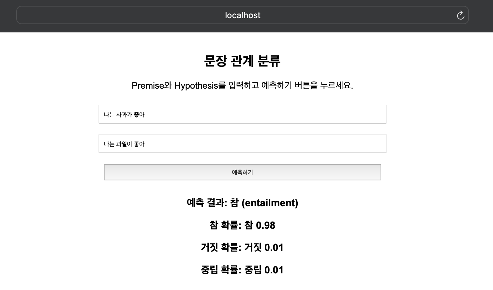
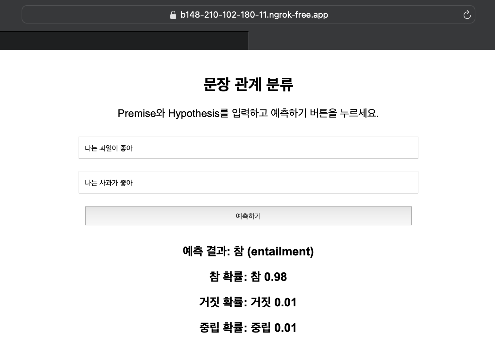

## Sentence pair classfication

### Use KC-BERT Base (beomi/kcbert-base) by Hugging Face

Model Structure : BERT Encoder Represetations from Transformers
 
### Datasets

Klue/nli bt Hugging Face datasets
 
NLI : Natural Language Inference

### Tokenizer

Use BertTokenizer(Max_length=64) 
 
### Hyper Parameter
•	batch_size: 32 (GPU 사용 가능 시) / 4 (CPU 사용 시) 
•	learning_rate: 5e-5 
•	max_seq_length: 64 
•	epochs: 5 
•	optimizer: AdamW 
•	weight_decay: 0.01 
•	evaluation_strategy: 매 epoch마다 검증 
 
### USE Flask & Ngrok

### Result

